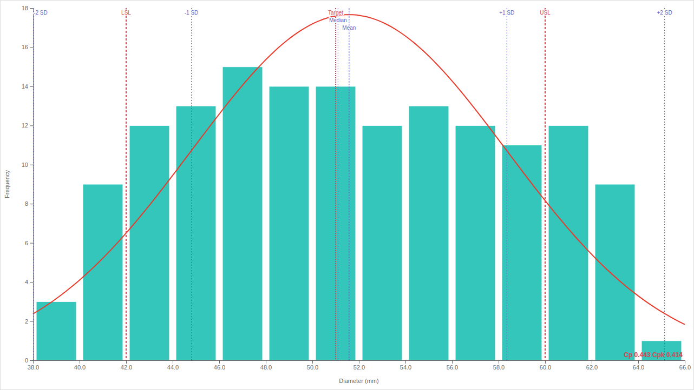

# Histogram+

**🌐 Other languages:** [Nederlands](docs/README.nl.md) · [Deutsch](docs/README.de.md) · [Français](docs/README.fr.md) · [Español](docs/README.es.md) · [简体中文](docs/README.zh.md)

A Power BI custom visual for numeric distributions, built for quality, process, and lab analysis. It gives you manual bin control, a normal curve overlay, LSL/USL spec limits with target line, Cp/Cpk plus optional sigma level + DPMO and an Anderson-Darling normality test, and a clean reference-line layer (mean, median, ±N SD).

## Features

- Three binning modes: **Auto (Sturges)**, **Number of bins**, and **Bin width**, with standard `[x)` intervals and the last bin closed on the right.
- Optional **custom x-axis range** that excludes values outside the visible range from bar counts.
- **Frequency (Count)** measure for correct binning of repeated or pre-grouped data.
- **Normal curve** overlay fitted to the data's mean and standard deviation.
- **Spec limits**: LSL, USL, Target line, and a capability readout that can show:
  - **Cp / Cpk**
  - **Sigma level + DPMO** (process capability translated to Six Sigma terms)
  - **Anderson-Darling p-value** (normality test)
- **Reference lines** for mean, median, and ±1/±2/±3 SD bands.
- **Compare by** grouping role for two-series histograms (e.g. male/female, region A/B, control/treatment) with four layouts: side by side, stacked, mirrored (back-to-back population pyramid), and overlay.
- Power BI **highlight / cross-highlight** rendering when the report passes highlight values.
- Adaptive x-axis label rotation, hover and focus crosshair guides, smooth enter animation, themed focus ring, full keyboard navigation (Arrow / Home / End / Enter / Esc).
- High-contrast support and `prefers-reduced-motion` respect.

## How to use

1. Add Histogram+ to your report (Visualizations pane → **Import a visual → from a file**).
2. Drag a numeric column to the **Values (numeric)** field.
3. If your data contains **repeated or integer-grouped values** (for example, age, score, or any column where the same value appears many times), also drag the same column to **Frequency (Count)** and set its aggregation to **Count**. Power BI groups categorical values before passing them to a custom visual; the Frequency measure carries the per-value count so bars are sized correctly.
4. Open the **Format** pane to adjust bin mode, axis range, spec limits, reference lines, and the capability readout.

### Tips

- For continuous measurements with near-unique decimals, you usually only need **Values (numeric)**.
- For pre-grouped data or integer surveys, the **Frequency = Count** pattern is required.
- Cp / Cpk only appears when both LSL and USL are set and LSL < USL.
- The Anderson-Darling test needs at least 8 observations and a non-zero sample standard deviation.

## Recipes

Short, copy-the-clicks guides for common setups.

### Group ages into 5-year buckets (or any width)
- Format pane → **Bins** → **Bin mode** = `Bin width` → **Bin width** = `5`.
- For 3-year buckets, set Bin width to `3`. For decades, `10`.

### Start the x-axis at a specific value (e.g. ages 20 and up)
- Format pane → **X axis** → toggle **Custom range** on.
- **Min** = `20`, **Max** = `80` (or whatever upper limit fits).
- Values outside that range are excluded from the bar counts entirely.

### Fixed number of bins, regardless of range
- Format pane → **Bins** → **Bin mode** = `Number of bins` → set the count (e.g. `15`).
- Useful when comparing the same chart across multiple datasets and you want a consistent bar count.

### Let Histogram+ pick the bins for you
- **Bin mode** = `Auto (Sturges)`.
- Auto switches strategy based on the data: Sturges for small samples, Freedman-Diaconis for large samples, and one bin per integer when the data is integer with a small range.

### Six Sigma / process capability setup
- Drag a measurement column to **Values (numeric)**.
- Format pane → **Spec limits** → toggle on. Enter LSL, USL, and optionally a Target value.
- Turn on **Show Cp / Cpk**. Cp / Cpk appear in the bottom-right corner.
- Turn on **Show sigma level + DPMO** to translate Cp/Cpk into Six Sigma terms.
- Turn on **Show Anderson-Darling p-value** to check whether the normal-curve assumption behind Cp/Cpk actually holds for this data.

### Visualize a bimodal distribution
- Use bin count high enough to see both peaks (try 18–25 bins).
- Turn on **Normal curve** — if the curve clearly misfits the bars, that's your bimodality cue.
- Turn on **Box plot** strip — a long box with whiskers that don't span both peaks confirms a non-normal shape.
- Turn on **Q-Q plot** — points that bow away from the 45° line confirm departure from normality.

### Show repeated / discrete data correctly
- Drag the same column to **Values (numeric)** AND **Frequency (Count)**.
- For the Frequency field, set the aggregation to **Count** (not Sum).
- Without this, Power BI groups identical values to a single bar — you'll see far fewer bars than you expect.

### Cross-filter with other visuals
- Click a bar to select it. Other visuals on the page filter to that subset.
- Hold **Ctrl** while clicking additional bars to multi-select.
- Use arrow keys to move the focus ring between bars, **Enter** or **Space** to select, **Esc** to clear.

### Compare two groups (population pyramid, male vs female, region A vs B)
- Drag the comparison column (e.g. `Gender`, `Region`) to **Compare by (optional)**.
- Histogram+ splits the data into one series per category.
- Format pane → **Comparison** → **Layout**:
  - **Side by side** — two bars per bin, useful for direct count comparison.
  - **Stacked** — totals visible per bin with both groups summed.
  - **Mirrored (back-to-back)** — population-pyramid style: first group up, second down from the zero line.
  - **Overlay** — translucent bars overlaid for distribution-shape comparison.
- Change **Second series color** to recolor the second group.
- Toggle **Show legend** off if you have the legend elsewhere on the report.

### Compare distributions across slicer choices
- Place a slicer on the report page (e.g. region, year).
- Histogram+ highlights the slicer-filtered subset on top of the full distribution, so you can see how the chosen segment compares to the whole.

### Compact / mobile layout
- At narrow viewports (below 300×200), axis titles drop and margins shrink automatically.
- Useful when embedding the visual in a tight grid cell or the Power BI mobile app.

### Custom number formatting
- Format pane → **X axis** → **Number format**. Accepts d3-format strings:
  - `.1f` — one decimal.
  - `,.0f` — thousands separator, no decimals.
  - `,.2~f` — thousands separator, up to two decimals, trim trailing zeros.
- Same field exists for the Y axis.

### High-contrast and accessibility
- Power BI's four high-contrast themes are respected: white-on-black, black-on-white, green-on-black, yellow-on-blue.
- Every bar has a screen-reader aria-label.
- The visual responds to the operating system's `prefers-reduced-motion` setting and skips animations under reduced motion.

## Languages

Histogram+ is localized in:

- English (`en-US`)
- Dutch (`nl-NL`)
- German (`de-DE`)
- French (`fr-FR`)
- Spanish (`es-ES`)
- Simplified Chinese (`zh-CN`)

Power BI Desktop uses the host language for the format pane, the on-canvas labels (Mean, Median, LSL, USL, Target, etc.), and the visual's empty-state and tooltip text.

## FAQ

**Does Power BI have a built-in histogram?**
No. Power BI Desktop has no native histogram visual. You can fake one with a clustered column chart and a bin-grouping DAX measure, but the result has no normal curve, no spec limits, no Cp/Cpk, and no normality testing. Histogram+ fills that gap.

**What's the difference between Histogram+ and the Microsoft "Histogram chart" Power BI visual?**
The Microsoft sample histogram visual is a rendering demo with auto-binning only. Histogram+ adds manual bin control (count or width), a custom x-axis range that excludes out-of-range values from counts, frequency-weighted binning for pre-grouped data, a normal curve overlay, LSL/USL spec limits, target line, Cp/Cpk, sigma level + DPMO, Anderson-Darling normality test, Q-Q plot, box plot, and mean/median/SD reference lines.

**How do I create a histogram in Power BI for quality / Six Sigma analysis?**
Install Histogram+ from AppSource, drag a numeric column (e.g. measured diameter, weight, lab pH) to **Values (numeric)**, and turn on **Spec limits** in the Format pane. Enter LSL and USL. Cp/Cpk appears automatically when both limits are set. Enable **Show sigma level + DPMO** to translate Cp/Cpk into the Six Sigma vocabulary that quality teams use.

**How do I handle repeated values like ages, scores, or integer measurements?**
Power BI groups categorical values before passing them to a custom visual. Drag the same column to **Frequency (Count)** in addition to **Values (numeric)** and set the aggregation to Count. Histogram+ then uses the count as the bar weight, so each bar is sized correctly.

**Is Histogram+ certified by Microsoft?**
The published version is built for the Microsoft certified track: `privileges: []`, no external network calls, source publicly mirrored to the GitHub `certification` branch.

**Is Histogram+ free?**
Version 1 is fully free with no feature gates. Source is MIT licensed.

**Does it work offline / in air-gapped environments?**
Yes. Histogram+ has zero external network dependencies. The visual runs entirely inside Power BI's sandbox.

## Privacy

Histogram+ stores no data, sends no telemetry, and makes no external network calls. The visual runs entirely inside the Power BI sandbox and only uses the data the report passes to it. `capabilities.json` declares `privileges: []`. The full source is published in this repository and is not minified.

## Support

Bugs, feature requests, and questions go to the [GitHub issue tracker](https://github.com/mkocontracting/histogram-plus/issues).

## License

MIT. See the `LICENSE` file (or the header in `src/visual.ts`).

## Development

If you want to build or modify Histogram+, see [CONTRIBUTING.md](CONTRIBUTING.md).
